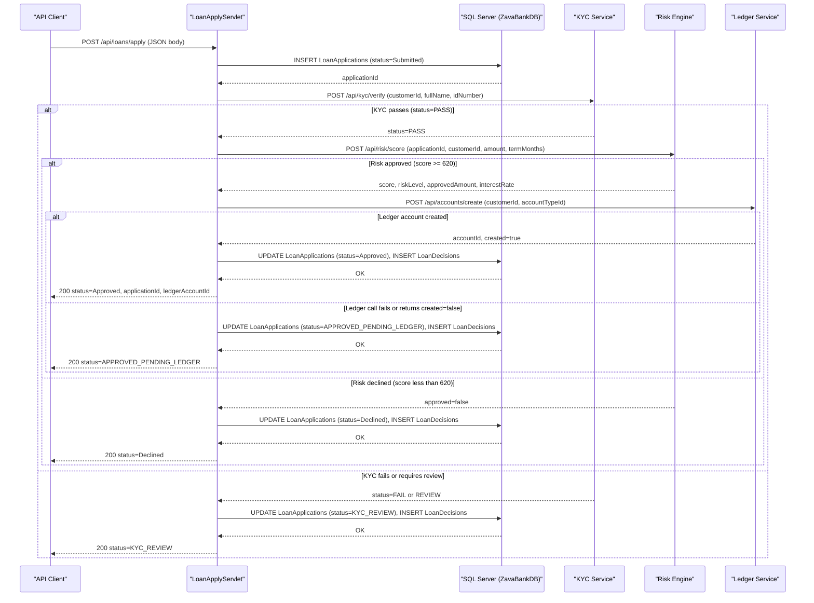

# API & Service Communication Contracts

ZavaLoanOriginationAPI exposes 4 HTTP endpoints via Jakarta EE Servlets and synchronously orchestrates 3 downstream microservices (KYC, Risk Engine, Ledger) using plain `java.net.HttpURLConnection` with no gateway, no resilience patterns, and no authentication.

## Service Catalog

| Service | Port | Category | Purpose |
|---|---|---|---|
| ZavaLoanOriginationAPI | 8080 | Business | Loan origination entry point — accepts applications, orchestrates decisioning, persists results |
| KYC Service (zava-kyc-service) | 8080 | Business | Identity and KYC verification for loan applicants |
| Risk Engine (zava-risk-engine) | 8080 | Business | Credit scoring and risk-level decisioning |
| Ledger Service (zava-ledger) | 8080 | Business | Bank account creation for approved loan applicants |

## API Endpoints Inventory

| Service | Method | Path | Request Type | Response Type |
|---|---|---|---|---|
| ZavaLoanOriginationAPI | GET | `/health` | — | HTML 200 status page |
| ZavaLoanOriginationAPI | (load-on-startup) | `/internal/bootstrap` | — | Initializes DB schema; not intended for external HTTP calls |
| ZavaLoanOriginationAPI | POST | `/api/loans/apply` | JSON body (customerId, loanProductId, requestedAmount, termMonths, purpose, fullName, idNumber, loanAccountTypeId) | JSON (applicationId, status, kycStatus, riskScore, riskLevel, approvedAmount, ledgerAccountCreated, ledgerAccountId) |
| ZavaLoanOriginationAPI | GET | `/api/loans/{id}/status` | Path param: numeric applicationId | JSON (applicationId, customerId, status, requestedAmount, approvedAmount, interestRate, termMonths, decisionDate, decisionNotes, loanAccountId) or 404/400 |

**Downstream calls made by ZavaLoanOriginationAPI (not public endpoints):**

| Downstream Service | Method | Path | Request Body | Response Body |
|---|---|---|---|---|
| KYC Service | POST | `/api/kyc/verify` | JSON (customerId, fullName, idNumber) | JSON (status: PASS/FAIL/REVIEW) |
| Risk Engine | POST | `/api/risk/score` | JSON (applicationId, customerId, requestedAmount, termMonths) | JSON (score, riskLevel, approved, approvedAmount, interestRate) |
| Ledger Service | POST | `/api/accounts/create` | JSON (customerId, accountTypeId, openingBalance, description) | JSON (accountId, created) |

## Management & Observability Endpoints

| Service | Endpoint | Custom Metrics |
|---|---|---|
| ZavaLoanOriginationAPI | `GET /health` | Returns a plain HTML page; no machine-readable health format, no metrics exposure |

No Spring Boot Actuator, Micrometer, Prometheus, or any structured health/metrics framework is present. The `/health` endpoint returns an HTML string with no diagnostic data.

## DTOs & Contracts

The application uses no formal DTO or record classes. All inbound and outbound HTTP payloads are parsed and serialized using `org.json.JSONObject` ad hoc within each servlet's handler method. There is no OpenAPI/Swagger specification, no protobuf schema, and no GraphQL schema.

The only internal transfer object is `OrchestrationResult`, a private static inner class inside `LoanApplyServlet`. It carries intermediate decisioning state (status, KYC status, risk score, risk level, approved amount, interest rate, ledger account ID) between the orchestration steps and is never serialized directly — its fields are manually written into a `JSONObject` for the HTTP response.

There is no serialization configuration; `org.json` serializes all output fields as plain key-value pairs.

## Communication Patterns

**Synchronous HTTP (blocking):** All inter-service communication uses `java.net.HttpURLConnection` directly with hard-coded timeouts of 7 000 ms (connect) and 7 000 ms (read). Calls to KYC, Risk Engine, and Ledger are made sequentially within a single request thread.

**No resilience patterns:** There are no circuit breakers, retry policies, bulkhead patterns, or fallback strategies. If a downstream service call fails or times out, the method `callJsonApi` silently catches all exceptions and returns an empty `JSONObject`. The loan application then continues with default/empty values (e.g., `kycStatus = "REVIEW"`, `riskScore = 0`), which may cause incorrect business outcomes without surfacing an error to the client.

**Service discovery:** None. All downstream service URLs are hardcoded environment variable strings (`KYC_SERVICE_BASE_URL`, `RISK_SERVICE_BASE_URL`, `LEDGER_SERVICE_BASE_URL`) with no dynamic discovery (no Eureka, Consul, Kubernetes DNS-based resolution, or service mesh).

**No API gateway:** The application is called directly; there is no load balancer, gateway, or BFF layer in the codebase.

**Startup dependency chain:** `LoanBootstrapServlet` is mapped to `load-on-startup=1` and runs DDL (`CREATE TABLE IF NOT EXISTS`) at application startup. The API endpoints are unavailable until this completes. There is no readiness probe or health-check wait mechanism.

**Security posture:** No authentication, no authorization, and no TLS are configured at any level. All four endpoints (`/health`, `/internal/bootstrap`, `/api/loans/apply`, `/api/loans/{id}/status`) are publicly accessible with no credential checks, role enforcement, or HTTPS requirement. The downstream microservice calls are also made over plain HTTP.

## Service Technology Matrix

| Service | Web Framework | Data Access | Discovery | Gateway | Health Check | Cache | Metrics |
|---|---|---|---|---|---|---|---|
| ZavaLoanOriginationAPI | Jakarta EE Servlet 4.0 / Tomcat 9 | Raw JDBC (no ORM) | None (env-var URLs) | None | Custom HTML `/health` | None | None |
| KYC Service | Unknown (external) | Unknown | — | — | Unknown | — | — |
| Risk Engine | Unknown (external) | Unknown | — | — | Unknown | — | — |
| Ledger Service | Unknown (external) | Unknown | — | — | Unknown | — | — |

## Service Communication Sequence

