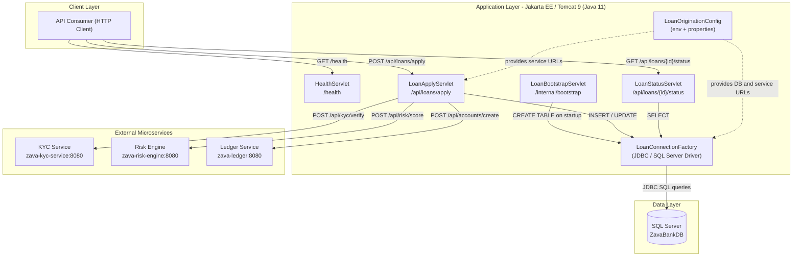
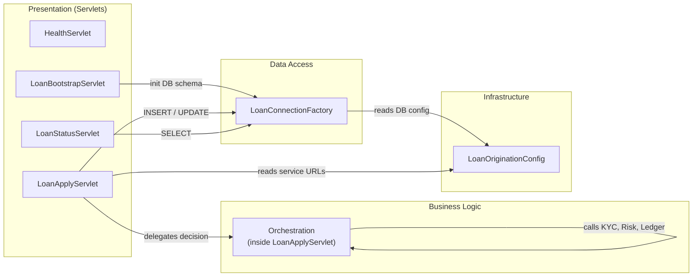

# Architecture Diagram

ZavaLoanOriginationAPI is a Jakarta EE (Servlet-based) Java 11 application deployed as a WAR on Apache Tomcat 9, providing a loan origination REST API that integrates with KYC, Risk Engine, and Ledger microservices while persisting data to Microsoft SQL Server.

## Application Architecture

### Technology Stack Summary

| Layer | Technology | Version | Purpose |
|---|---|---|---|
| Runtime | Apache Tomcat | 9 | Java Servlet container hosting the WAR |
| Language | Java | 11 | Application source language |
| Build Tool | Gradle | 7.6 | Build and WAR packaging |
| Web Framework | Jakarta EE Servlet API | 4.0 | HTTP request/response handling |
| Database Driver | Microsoft JDBC Driver for SQL Server | 12.6.3 | JDBC connectivity to SQL Server |
| JSON Processing | org.json | 20140107 | JSON parsing and response serialization |
| Containerization | Docker (multi-stage build) | — | Build (gradle:7.6-jdk11) → Runtime (tomcat:9-jdk11) |

### Data Storage & External Services

The application stores all loan application records and decisions in **Microsoft SQL Server** (database `ZavaBankDB`) via raw JDBC with the `com.microsoft.sqlserver:mssql-jdbc` driver. Two tables are auto-created at startup by `LoanBootstrapServlet`: `LoanApplications` (loan lifecycle data) and `LoanDecisions` (credit decision audit trail). The application orchestrates three downstream HTTP microservices for each loan decision: a **KYC Service** (`zava-kyc-service:8080`) for identity verification, a **Risk Engine** (`zava-risk-engine:8080`) for credit scoring, and a **Ledger Service** (`zava-ledger:8080`) for loan account creation. Service URLs and database credentials are sourced from environment variables or from `loan-origination.properties`.

### Key Architectural Decisions

- **Raw JDBC without ORM**: The application uses `DriverManager.getConnection` with `PreparedStatement` directly rather than JPA or any ORM, keeping the data layer lightweight but coupling SQL tightly to the servlet code.
- **Synchronous orchestration pipeline**: Loan decisioning calls KYC → Risk Engine → Ledger sequentially within a single HTTP request/response cycle, using a single JDBC transaction for SQL writes.
- **Configuration via environment variables with properties file fallback**: `LoanOriginationConfig` reads environment variables first, falling back to `loan-origination.properties` for all database and service endpoint configuration.

## Component Relationships

### Component Inventory

| Component | Layer | Type | Responsibility |
|---|---|---|---|
| HealthServlet | Presentation | Jakarta EE HttpServlet | Returns a plain-text health status page at `/health` |
| LoanBootstrapServlet | Presentation | Jakarta EE HttpServlet | Auto-creates `LoanApplications` and `LoanDecisions` tables in SQL Server on application startup |
| LoanApplyServlet | Presentation / Business Logic | Jakarta EE HttpServlet | Accepts POST `/api/loans/apply`, orchestrates KYC → Risk → Ledger calls, persists application record and decision |
| LoanStatusServlet | Presentation | Jakarta EE HttpServlet | Accepts GET `/api/loans/{id}/status`, queries SQL Server and returns loan application state as JSON |
| LoanOriginationConfig | Infrastructure | Configuration utility (static) | Resolves all configuration values (DB URL/credentials, service base URLs, default interest rate) from env vars with properties file fallback |
| LoanConnectionFactory | Data Access | JDBC factory (static) | Loads SQL Server JDBC driver and creates raw `java.sql.Connection` objects using credentials from `LoanOriginationConfig` |
