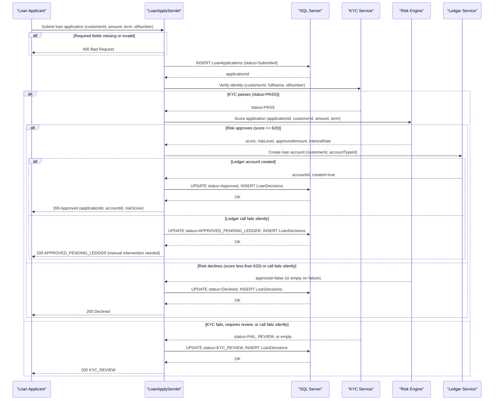

# Core Business Workflows

ZavaLoanOriginationAPI automates the full loan origination lifecycle: it accepts applications from banking customers, orchestrates KYC identity verification and credit risk scoring through downstream microservices, and provisions a ledger account for approved borrowers — all within a single synchronous decision pipeline.

## Domain Entities

| Entity | Service / Bounded Context | Description | Key Relationships |
|---|---|---|---|
| LoanApplication | Loan Origination | Represents a customer's request for credit, tracking the submitted terms, the decisioning outcome, and the resulting account reference | Has zero or more LoanDecisions (one per decision event) |
| LoanDecision | Loan Origination | Immutable audit record of a credit decision event, capturing who decided, the risk score at decision time, and the decision rationale | Belongs to one LoanApplication |
| Customer (external) | KYC / Customer domain (external service) | The individual applying for the loan; identified by `customerId` and subject to KYC verification | Referenced by `customerId` in LoanApplication; owned by the KYC service |
| LoanProduct (external) | Product Catalog (external) | Defines the loan product type being applied for (term, purpose category, rate basis) | Referenced by `loanProductId` in LoanApplication; not owned by this service |
| LedgerAccount (external) | Ledger / Accounting domain (external service) | Bank account created upon loan approval to disburse and track the loan | Created by the Ledger Service; `loanAccountId` stored back in LoanApplication |

## Service-to-Domain Mapping

| Service | Domain Context | Owned Entities | External Dependencies |
|---|---|---|---|
| ZavaLoanOriginationAPI | Loan Origination | LoanApplication, LoanDecision | Depends on KYC Service (identity verification), Risk Engine (credit scoring), Ledger Service (account creation) |
| KYC Service (zava-kyc-service) | Identity & Compliance | Customer identity records | Receives: customerId, fullName, idNumber |
| Risk Engine (zava-risk-engine) | Credit Risk | Credit scores, risk assessments | Receives: applicationId, customerId, requestedAmount, termMonths |
| Ledger Service (zava-ledger) | Banking Accounts | LedgerAccount | Receives: customerId, accountTypeId, openingBalance, description |

## Primary Workflows

### Workflow 1: Loan Application Submission

The primary workflow — triggered by `POST /api/loans/apply` — drives the complete origination pipeline for a new loan request.

**Steps:**
1. **Input validation**: Verify that `customerId`, `loanProductId`, `requestedAmount`, and `termMonths` are all present and positive. Reject immediately with HTTP 400 if any required field is missing or invalid. Default `fullName` to `"Customer {customerId}"` if not provided.
2. **Persist initial record**: Insert a `LoanApplications` row with `Status = 'Submitted'` and the requested terms. Capture the generated `ApplicationID`.
3. **KYC verification**: Call the KYC Service with `customerId`, `fullName`, and `idNumber`. If the result is anything other than `PASS`, set `Status = 'KYC_REVIEW'` and return early with a decision reason — no further orchestration takes place.
4. **Credit risk scoring**: Call the Risk Engine with `applicationId`, `customerId`, `requestedAmount`, and `termMonths`. Receive a risk score (0–850 scale), risk level classification (Low/Medium/High), and an approval recommendation. If `approved = false`, set `Status = 'Declined'` and return.
5. **Ledger account provisioning**: Call the Ledger Service to create a loan account for the customer. If creation succeeds (returns `created = true` with an `accountId`), set `Status = 'Approved'`; otherwise set `Status = 'APPROVED_PENDING_LEDGER'`.
6. **Persist decision**: Within a single JDBC transaction, update the `LoanApplications` row with the final status, approved amount, interest rate, and ledger account ID; insert a `LoanDecisions` row with the full audit details.
7. **Return result**: Respond with the application ID, final status, KYC status, risk score/level, approved amount, and ledger creation result.

### Workflow 2: Loan Status Inquiry

Triggered by `GET /api/loans/{id}/status`. Retrieves a single `LoanApplications` record by primary key and returns its current state as JSON. Returns HTTP 404 if the application does not exist, HTTP 400 if the ID is non-numeric.

### Workflow 3: Schema Bootstrap

Triggered at application startup (`LoanBootstrapServlet`, `load-on-startup=1`). Connects to SQL Server and conditionally creates the `LoanApplications` and `LoanDecisions` tables if they do not already exist. The API is unavailable until this completes successfully.

## Cross-Service Data Flows

The orchestration in `LoanApplyServlet` is a synchronous sequential pipeline with no parallelism:

1. **KYC gate**: The application passes `customerId`, `fullName`, and `idNumber` to the KYC Service. The KYC result acts as a binary gate — only a `PASS` allows the pipeline to continue. If the KYC call fails due to a network error or timeout (7 s), `callJsonApi` returns an empty JSON object, `kycStatus` defaults to `"REVIEW"`, and the application lands in `KYC_REVIEW` status (business process continues as a soft failure rather than a hard error).

2. **Risk enrichment**: The Risk Engine receives the application context and returns enriched data: `score`, `riskLevel`, `approved`, `approvedAmount`, and `interestRate`. These values are stored in both `LoanApplications` and `LoanDecisions`. If the risk call fails silently, `approved` defaults to `false` (score=0 < 620), resulting in an automatic decline — a silent data-loss scenario.

3. **Ledger account creation**: On approval, the Ledger Service is asked to open a loan account. The returned `accountId` is persisted back to `LoanApplications.LoanAccountID`. If ledger creation fails silently, the loan is recorded as `APPROVED_PENDING_LEDGER` — approved by risk but without an account, requiring manual intervention.

**Fallback behavior summary:**
- KYC failure → silent default to `status=KYC_REVIEW` (no error surfaced to client)
- Risk Engine failure → silent default to `approved=false`, `status=Declined`
- Ledger failure → silent default to `status=APPROVED_PENDING_LEDGER`

## Business Workflow Sequence



## Business Rules & Decision Logic

### Validation Rules

- `customerId` must be a positive integer (> 0); otherwise HTTP 400.
- `loanProductId` must be a positive integer (> 0); otherwise HTTP 400.
- `requestedAmount` must be greater than zero; otherwise HTTP 400.
- `termMonths` must be a positive integer (> 0); otherwise HTTP 400.
- `fullName` is optional; defaults to `"Customer {customerId}"` if absent or blank.
- `idNumber` and `purpose` are optional strings; no format validation is applied.

### Decision Logic

| Stage | Condition | Outcome |
|---|---|---|
| KYC gate | `kycStatus == "PASS"` | Proceed to risk scoring |
| KYC gate | `kycStatus` is anything else (FAIL, REVIEW, or empty on timeout) | `status = KYC_REVIEW`; pipeline stops |
| Risk scoring | `approved == true` (explicit) OR `score >= 620` (fallback heuristic) | Proceed to ledger account creation |
| Risk scoring | `approved == false` OR `score < 620` OR call fails silently | `status = Declined`; pipeline stops |
| Risk level classification | `score >= 700` | `riskLevel = Low` |
| Risk level classification | `620 <= score < 700` | `riskLevel = Medium` |
| Risk level classification | `score < 620` | `riskLevel = High` |
| Default interest rate | Risk Engine provides no `interestRate` field | Use `loan.default.interestRate` (7.25%) |
| Ledger provisioning | Ledger returns `created = true` with `accountId > 0` | `status = Approved`; `loanAccountId` stored |
| Ledger provisioning | Ledger returns `created = false` or call fails silently | `status = APPROVED_PENDING_LEDGER` |

### State Transitions

```
LoanApplication lifecycle:
  [Submitted] → KYC_REVIEW   (KYC not passed)
  [Submitted] → Declined     (risk engine declines)
  [Submitted] → Approved     (risk approved + ledger created)
  [Submitted] → APPROVED_PENDING_LEDGER  (risk approved + ledger failed)
```

There are no further state transitions defined in the codebase. Re-processing, cancellation, disbursement, or repayment states are not modelled.

### Transaction Boundaries

The INSERT (new application) + UPDATE (final decision) + INSERT (decision record) sequence in `LoanApplyServlet` is wrapped in a single JDBC transaction (`setAutoCommit(false)` / `commit()` / `rollback()`). The three downstream HTTP calls to KYC, Risk, and Ledger services occur **outside** this transaction boundary — they are called before the transaction is committed, so their side effects (KYC logs, risk records, account creation in external services) are not rolled back if the SQL Server transaction fails.

### Error Handling

- SQL errors during data persistence result in a transaction rollback and HTTP 500 to the client.
- All downstream HTTP errors are silently swallowed by `callJsonApi` (returns empty JSON); no compensating actions or alerts are triggered.
- The `APPROVED_PENDING_LEDGER` status is the implicit compensating state for a failed ledger call, but there is no automated retry or reconciliation process defined.

### Audit Trail

Every loan application has a corresponding `LoanDecisions` record capturing the decision type (`Approve`, `ManualReview`, `Decline`), the risk score and level at decision time, and the full decision rationale including KYC status, risk level, and term. The `DecisionBy` field is hardcoded to `"LoanOriginationAPI"`.
