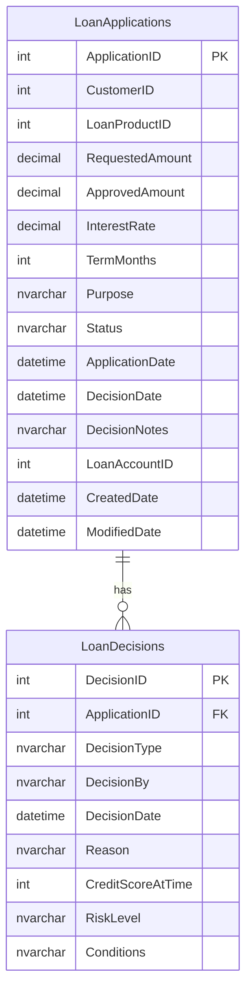

# Data Architecture & Persistence Layer

ZavaLoanOriginationAPI persists to two SQL Server tables (`LoanApplications`, `LoanDecisions`) via raw JDBC with no ORM, no connection pool, and no migration framework; schema is bootstrapped programmatically at application startup.

## Database Configuration

| Service/Module | DB Type | Profile | Driver | Connection | Migration Tool |
|---|---|---|---|---|---|
| ZavaLoanOriginationAPI | Microsoft SQL Server | Single (no profiles) | mssql-jdbc 12.6.3.jre11 (JDBC 4.2) | `jdbc:sqlserver://{host}:{port};databaseName=ZavaBankDB;encrypt=false;trustServerCertificate=true` — host/port/name from env vars or properties file | None — DDL executed by `LoanBootstrapServlet` at startup (SQL Server `IF OBJECT_ID ... IS NULL CREATE TABLE`) |

No connection pooling is configured; a new physical SQL Server connection is opened per request via `DriverManager.getConnection`. No Flyway, Liquibase, or any versioned migration tool is in use. The `trustServerCertificate=true` and `encrypt=false` JDBC URL flags disable TLS encryption on the database connection.

## Data Ownership per Service

| Service | Tables Owned | ORM Framework | Caching | Notes |
|---|---|---|---|---|
| ZavaLoanOriginationAPI | LoanApplications, LoanDecisions | None (raw JDBC via `PreparedStatement`) | None | Schema is auto-created at startup by `LoanBootstrapServlet`. No DDL versioning or rollback capability. |

## Entity Model

## Key Repository Methods

There are no formal repository interface classes. All data access is implemented inline within the Servlet handler methods using raw `java.sql.PreparedStatement`. The following table documents the notable SQL operations by class:

| Service | Class | Notable SQL Operations | Purpose |
|---|---|---|---|
| ZavaLoanOriginationAPI | `LoanBootstrapServlet.init()` | `CREATE TABLE LoanApplications (...)` / `CREATE TABLE LoanDecisions (...)` (IF NOT EXISTS) | One-time DDL bootstrap at container startup |
| ZavaLoanOriginationAPI | `LoanApplyServlet.insertApplication()` | `INSERT INTO LoanApplications ... RETURN_GENERATED_KEYS` | Creates the initial loan application record and returns the generated `ApplicationID` |
| ZavaLoanOriginationAPI | `LoanApplyServlet.updateApplication()` | `UPDATE LoanApplications SET Status, ApprovedAmount, InterestRate, DecisionDate, DecisionNotes, LoanAccountID WHERE ApplicationID=?` | Updates the application with the final decision outcome |
| ZavaLoanOriginationAPI | `LoanApplyServlet.insertDecision()` | `INSERT INTO LoanDecisions (ApplicationID, DecisionType, DecisionBy, DecisionDate, Reason, CreditScoreAtTime, RiskLevel, Conditions)` | Appends the credit decision audit record |
| ZavaLoanOriginationAPI | `LoanStatusServlet.doGet()` | `SELECT ApplicationID, CustomerID, Status, RequestedAmount, ApprovedAmount, InterestRate, TermMonths, DecisionDate, DecisionNotes, LoanAccountID FROM LoanApplications WHERE ApplicationID=?` | Retrieves a single application record by primary key |

Transaction management: `LoanApplyServlet` manually calls `connection.setAutoCommit(false)` and `connection.commit()` / `connection.rollback()` around the INSERT + UPDATE + INSERT sequence. All other SQL operations run in auto-commit mode. There are no `@Transactional` annotations or any declarative transaction management.

## Caching Strategy

No caching layer is present. The application performs a direct SQL Server query on every request with no query result caching, second-level cache, or in-memory store. All reads and writes go directly to the database over a new physical JDBC connection per request.

## Data Ownership Boundaries

ZavaLoanOriginationAPI is the sole owner of the `ZavaBankDB` database and its two tables. No other service in the observed configuration accesses these tables directly. The KYC, Risk Engine, and Ledger services are called via synchronous HTTP and maintain their own data stores (not observable from this codebase).

Cross-service data flows are API-only: loan application context is passed as JSON payloads in outbound HTTP POST requests (customerId, applicationId, requestedAmount, termMonths, etc.), and the results are stored back in `LoanApplications` (approved amount, interest rate, ledger account ID) and `LoanDecisions` (risk score, risk level, decision outcome). There is no direct cross-service database access.

All write operations to `LoanApplications` and `LoanDecisions` are performed within a single manually managed JDBC transaction in `LoanApplyServlet`, providing atomicity for the INSERT + UPDATE + decision record flow. Read operations (`LoanStatusServlet`) are auto-commit and read-only.

### Data Classification & Sensitivity

| Entity | Sensitive Fields | Classification | Controls in Place |
|---|---|---|---|
| LoanApplications | `CustomerID` (customer reference), `Purpose` (free-text loan purpose, may contain personal details) | PII (indirect reference) | None — no encryption-at-rest, no field masking, no access controls |
| LoanApplications | `ApprovedAmount`, `RequestedAmount`, `InterestRate` | Financial data | None — stored in plaintext; no column-level encryption |
| LoanDecisions | `CreditScoreAtTime`, `RiskLevel`, `Reason`, `Conditions` | Financial / creditworthiness data | None — stored in plaintext |
| LoanApplyServlet (runtime only) | `idNumber` (national ID, received in request body), `fullName` (applicant name) | PII | These fields are passed to the KYC Service but are **not persisted** to the database; they exist only in-memory during the request |

The database connection uses `encrypt=false` and `trustServerCertificate=true`, meaning the JDBC channel between the application and SQL Server is unencrypted. No encryption-at-rest, data masking, column-level security, or row-level security is configured on any table.
