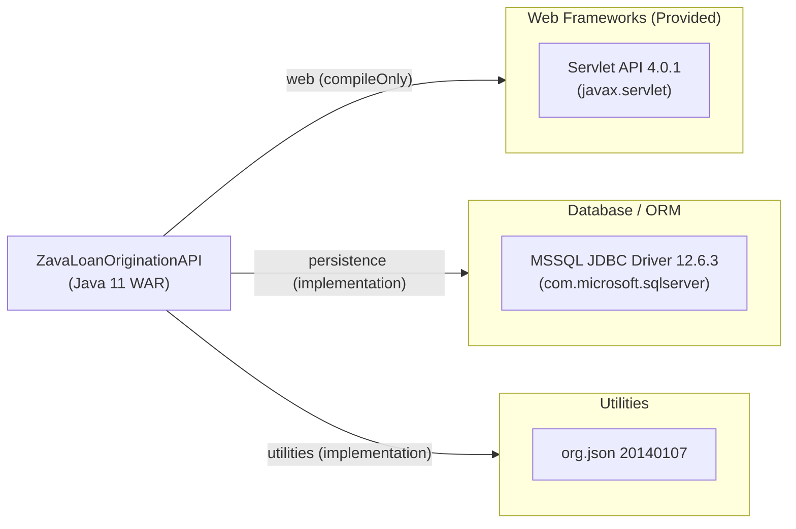

# Dependency Map

ZavaLoanOriginationAPI declares 3 external dependencies (Gradle `build.gradle`): one provided Servlet API and two runtime libraries for database connectivity and JSON handling. No test-scope dependencies are declared.

## Dependencies

### Dependency Summary

| Category | Count | Key Libraries | Notes |
|---|---|---|---|
| Web Frameworks | 1 | javax.servlet:javax.servlet-api 4.0.1 | `compileOnly` — provided by Tomcat at runtime; targets the legacy `javax.*` namespace (Jakarta EE 8) rather than the modern `jakarta.*` namespace (Jakarta EE 9+) |
| Database / ORM | 1 | com.microsoft.sqlserver:mssql-jdbc 12.6.3.jre11 | Current stable JDBC 4.2 driver for SQL Server; no ORM layer |
| Utilities | 1 | org.json:json 20140107 | JSON parsing library pinned to a 2014 release |

### Version & Compatibility Risks

`javax.servlet:javax.servlet-api:4.0.1` targets the legacy `javax.*` namespace (Servlet 4.0 / Jakarta EE 8). Migration to Jakarta EE 9+ requires a namespace change from `javax.*` to `jakarta.*` across all source files and a corresponding upgrade to Tomcat 10+ or another Jakarta EE 9-compatible container. `org.json:json:20140107` is pinned to an artifact published in 2014; while functionally stable, it predates many security and API fixes available in later versions (the project is more than 10 years old). The MSSQL JDBC driver at 12.6.3 is a recent release and does not present compatibility concerns on its own.

### Notable Observations

- **No ORM or connection pooling**: The application uses raw JDBC with `DriverManager.getConnection`, creating a new physical SQL Server connection per request with no pooling (e.g., HikariCP, DBCP2). This is a scalability and resource-management concern in production.
- **org.json pinned to a decade-old release**: Version `20140107` (released January 2014) is over ten years old. Later releases fix known defects and improve API surface. Migration to `org.json:json:20240303` or a modern alternative such as Jackson Databind would be advisable.
- **Minimal dependency footprint**: With only 3 declared dependencies and no framework (Spring, Quarkus, etc.), the application is highly portable but also entirely hand-rolled — all cross-cutting concerns (logging, tracing, connection pooling, error handling) are absent or manual.
- **No logging library declared**: The application has no SLF4J, Log4j 2, or Logback dependency, meaning all diagnostic output relies on `System.out` / servlet container logging with no structured or configurable log output.

## Test Dependencies

No test-scoped dependencies detected. The `build.gradle` declares no test frameworks (e.g., JUnit, Mockito, AssertJ).

Total test-scope dependencies: **0**

No automated test infrastructure is present. There are no unit, integration, or contract tests in the repository. Adding a test framework (e.g., JUnit 5 + Mockito) would be a recommended first step before any modernization effort.
