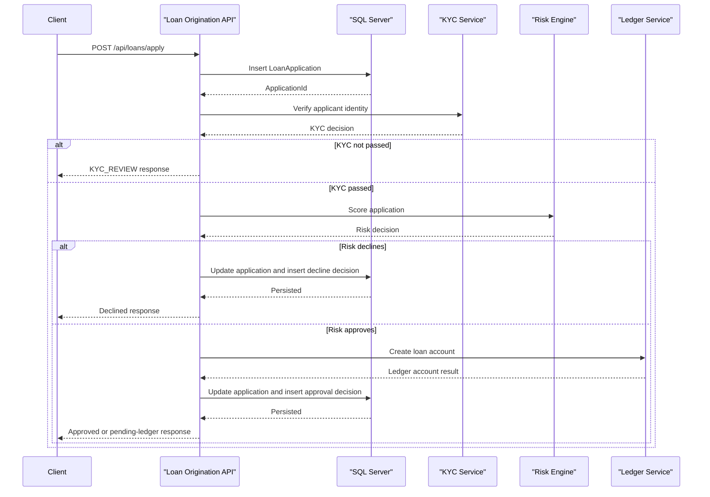

# API & Service Communication Contracts

This application exposes a very small servlet-based API surface with one main loan submission flow, one status lookup flow, and a couple of operational endpoints. All business communication is synchronous and request-response driven.

## Service Catalog

| Service | Port | Category | Purpose |
|---|---:|---|---|
| Zava Loan Origination API | 8080 | API Layer | Accepts loan applications, stores decisions, and exposes application status |

## API Endpoints Inventory

| Service | Method | Path | Request Type | Response Type |
|---|---|---|---|---|
| Zava Loan Origination API | POST | `/api/loans/apply` | JSON body with applicant, product, amount, term, and purpose fields | JSON response with status, application id, KYC outcome, risk score, approved amount, and ledger details |
| Zava Loan Origination API | GET | `/api/loans/{id}/status` | Path parameter `id` | JSON response containing stored application and decision state |
| Zava Loan Origination API | GET | `/health` | None | Simple HTML availability response |
| Zava Loan Origination API | GET | `/internal/bootstrap` | None | Servlet init path used to bootstrap schema on startup |

## Management & Observability Endpoints

| Service | Endpoint | Custom Metrics (if any) |
|---|---|---|
| Zava Loan Origination API | `/health` | None detected |
| Zava Loan Origination API | `/internal/bootstrap` | None detected |

## DTOs & Contracts

The application does not define explicit DTO classes; request and response contracts are assembled directly with `org.json.JSONObject` instances inside the servlet layer. The primary request contract is the loan application payload consumed by `LoanApplyServlet`, while the response contracts are dynamic JSON objects for application submission and status retrieval. No gateway-level aggregation DTOs, OpenAPI specification, protobuf schema, or GraphQL schema were detected.

## Communication Patterns

All communication is synchronous. `LoanApplyServlet` performs three sequential outbound HTTP POST requests: first to the KYC service, then to the risk engine, and finally to the ledger service if the application is approved. The service also performs direct JDBC reads and writes to SQL Server in the same request flow. Resilience is limited to connection and read timeouts of seven seconds for outbound calls, with no circuit breaker, retry policy, or fallback beyond returning an empty JSON object when a downstream call fails. Startup availability depends on SQL Server being reachable because `LoanBootstrapServlet` creates the schema during initialization. No authentication, authorization, or TLS enforcement is implemented at the API contract layer; endpoints are servlet-mapped and publicly reachable, and downstream service URLs are configured as plain HTTP.

## Service Technology Matrix

| Service | Web | Data Access | Discovery | Gateway | Actuator | Cache | Metrics |
|---|---|---|---|---|---|---|---|
| Zava Loan Origination API | Servlet API | JDBC | None | No | No | No | No |

## Service Communication Sequence

