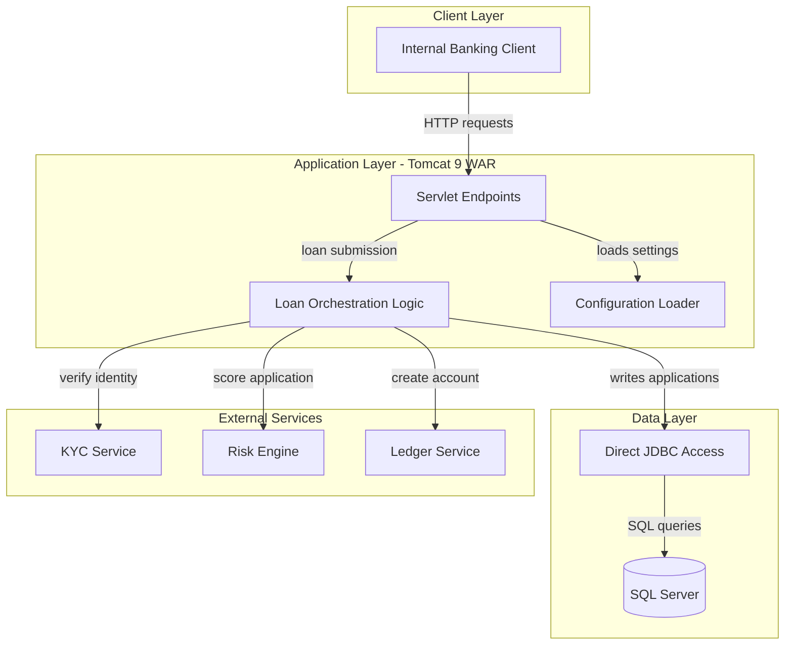
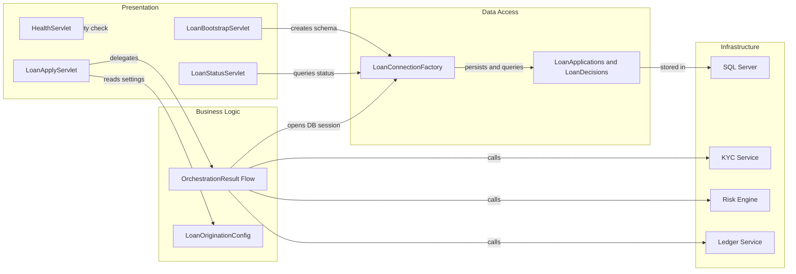

# Architecture Diagram

This document summarizes the runtime architecture of the Zava Loan Origination API and the main components that participate in request processing and persistence.

## Application Architecture

### Technology Stack Summary

| Layer | Technology | Version | Purpose |
|---|---|---|---|
| Presentation | Java Servlet API | 4.0.1 | Exposes health, bootstrap, apply, and status endpoints |
| Application | Apache Tomcat | 9 on JDK 11 | Hosts the WAR and executes servlet lifecycle hooks |
| Business Logic | Custom servlet orchestration | N/A | Coordinates KYC, risk, ledger, and persistence operations |
| Data Access | JDBC Driver for SQL Server | 12.6.3.jre11 | Opens SQL Server connections and runs SQL statements |
| Packaging | Gradle WAR plugin | Project-defined | Builds a deployable `ROOT.war` artifact |

### Data Storage & External Services

The application persists loan applications and loan decisions in SQL Server by issuing direct JDBC statements and bootstrap DDL at startup. It also depends on three downstream HTTP services: a KYC service for identity verification, a risk engine for approval decisions, and a ledger service for account creation after approval.

### Key Architectural Decisions

- Uses a classic servlet WAR deployment model with `web.xml` mappings instead of Spring Boot or JAX-RS auto-configuration.
- Keeps orchestration logic inside the `LoanApplyServlet`, which couples request handling, downstream service calls, and persistence in a single component.
- Creates required database tables during servlet initialization instead of using a dedicated schema migration tool.

## Component Relationships

### Component Inventory

| Component | Layer | Type | Responsibility |
|---|---|---|---|
| `HealthServlet` | Presentation | Servlet | Returns a simple health page for availability checks |
| `LoanBootstrapServlet` | Presentation | Servlet initializer | Creates required SQL tables when the web application starts |
| `LoanApplyServlet` | Presentation | Servlet | Accepts loan applications and orchestrates downstream decisions |
| `LoanStatusServlet` | Presentation | Servlet | Retrieves current application status from SQL Server |
| `LoanOriginationConfig` | Business Logic | Configuration helper | Resolves properties from environment variables and bundled properties |
| `LoanConnectionFactory` | Data Access | Connection factory | Creates JDBC connections to SQL Server |
| `LoanApplications` | Data Access | SQL table | Stores submitted applications and approval outcomes |
| `LoanDecisions` | Data Access | SQL table | Stores decision audit entries for each application |
