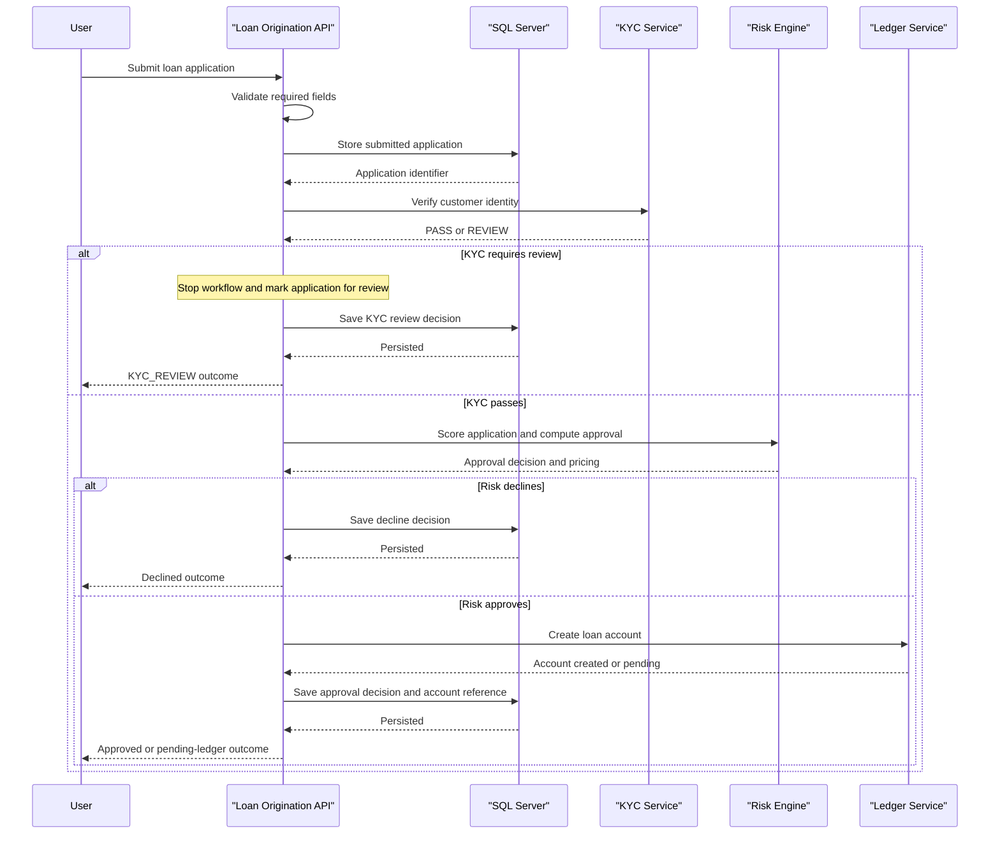

# Core Business Workflows

This application supports the loan-origination portion of a banking workflow by receiving a loan request, validating identity and risk with downstream services, and recording the resulting decision. Its business logic is concentrated in a small set of servlet endpoints.

## Domain Entities

| Entity | Service / Bounded Context | Description | Key Relationships |
|---|---|---|---|
| Loan Application | Loan Origination | Represents a customer request for a loan product and tracks lifecycle status from submission through decision | Produces one or more decision records and may reference a ledger account |
| Loan Decision | Loan Origination | Captures the approval, decline, or manual-review outcome for an application | Belongs to a single loan application |
| KYC Result | External KYC Context | Indicates whether identity verification passes or requires manual review | Influences whether risk scoring can proceed |
| Risk Assessment | External Risk Context | Determines approval status, score, risk level, and pricing details | Drives approval and approved amount |
| Ledger Account | External Ledger Context | Represents the loan account created after approval | Linked back to the loan application by account id |

## Service-to-Domain Mapping

| Service | Domain Context | Owned Entities | External Dependencies |
|---|---|---|---|
| Zava Loan Origination API | Loan Origination | Loan Application, Loan Decision | SQL Server, KYC service, Risk engine, Ledger service |
| KYC Service | Identity Verification | KYC Result | Called synchronously by loan origination |
| Risk Engine | Credit Decisioning | Risk Assessment | Called synchronously after KYC succeeds |
| Ledger Service | Accounting | Ledger Account | Called synchronously after approval |

## Primary Workflows

### Workflow 1: Submit loan application

1. A client sends `POST /api/loans/apply` with customer, product, amount, term, and identity data.
2. The API validates the minimum required fields and rejects malformed or incomplete payloads with HTTP 400.
3. The application inserts a new loan-application row in SQL Server in `Submitted` state.
4. The service sends identity data to the KYC service.
5. If KYC does not pass, the workflow ends in `KYC_REVIEW` and stores a manual-review style decision note.
6. If KYC passes, the risk engine evaluates the application and returns score, risk level, approval, approved amount, and optionally pricing.
7. If risk declines the request, the application stores a decline decision and finishes the workflow.
8. If risk approves the request, the ledger service is asked to create a loan account.
9. The API updates the stored application, records a decision row, commits the database transaction, and returns the outcome.

### Workflow 2: Retrieve application status

1. A client sends `GET /api/loans/{id}/status`.
2. The API validates the path shape and the numeric application id.
3. The service queries SQL Server for the matching application row.
4. If the record exists, the API returns the persisted decision state and related details as JSON.

## Cross-Service Data Flows

The cross-service data flow is orchestration-heavy rather than event-driven. The loan-origination API is the source of truth for loan application records and coordinates with external services in sequence: it sends applicant identity data to KYC, forwards application details to the risk engine, and finally requests loan-account creation from the ledger service when approval is granted. The final client response composes these external outcomes with local persistence state. When the KYC or risk decision prevents progression, the workflow ends early. When the ledger service does not confirm account creation, the business outcome degrades to `APPROVED_PENDING_LEDGER` rather than fully approved.

## Business Workflow Sequence

## Business Rules & Decision Logic

- `customerId`, `loanProductId`, `requestedAmount`, and `termMonths` are mandatory for submission; invalid payloads are rejected with HTTP 400.
- If `fullName` is absent, the API substitutes a generated fallback name based on the customer id.
- KYC must return `PASS` before the risk engine is invoked.
- If the risk engine does not explicitly approve the request, the application is declined.
- If the ledger account cannot be created after approval, the workflow still records the application as `APPROVED_PENDING_LEDGER` instead of rolling back the approval result.
- Database writes for submission, status update, and decision audit are executed inside a single JDBC transaction in `LoanApplyServlet`.
