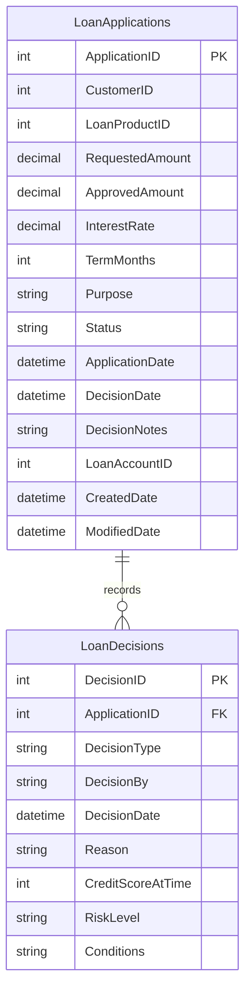

# Data Architecture & Persistence Layer

The data layer is intentionally small and centers on a SQL Server schema with two tables managed through JDBC. Persistence logic is embedded directly in servlets rather than separated into repositories or an ORM model.

## Database Configuration

| Service/Module | DB Type | Profile | Driver | Connection | Migration Tool |
|---|---|---|---|---|---|
| Zava Loan Origination API | SQL Server | Default | `mssql-jdbc 12.6.3.jre11` | JDBC URL built from `DB_HOST`, `DB_PORT`, and `DB_NAME`; encryption disabled and server certificate trusted | None |

## Data Ownership per Service

| Service | Tables Owned | ORM Framework | Caching | Notes |
|---|---|---|---|---|
| Zava Loan Origination API | `LoanApplications`, `LoanDecisions` | Direct JDBC | None | Schema is created at servlet startup by `LoanBootstrapServlet` |

## Entity Model

## Key Repository Methods

| Service | Repository | Notable Methods | Purpose |
|---|---|---|---|
| Zava Loan Origination API | `LoanApplyServlet` | `insertApplication(...)`, `updateApplication(...)`, `insertDecision(...)` | Persists the initial submission and the final decision outcome |
| Zava Loan Origination API | `LoanStatusServlet` | Inline `SELECT ... FROM LoanApplications WHERE ApplicationID = ?` | Loads the persisted status projection for a single application |
| Zava Loan Origination API | `LoanBootstrapServlet` | Inline DDL for `LoanApplications` and `LoanDecisions` | Ensures required tables exist during application startup |

## Caching Strategy

No caching layer was detected. Every status lookup and loan submission interacts directly with SQL Server, and no in-memory, distributed, or annotation-driven cache configuration exists in the repository.

## Data Ownership Boundaries

The application owns a single local SQL Server schema and does not share direct database access with other services in the repository. Cross-service coordination happens through synchronous HTTP calls to KYC, risk, and ledger systems rather than shared tables or batch query APIs. There is no CQRS separation; request processing mixes reads, writes, and external orchestration inside the same servlet flow.

### Data Classification & Sensitivity

| Entity | Sensitive Fields | Classification (PII/PHI/PCI/None) | Controls in Place |
|---|---|---|---|
| `LoanApplications` | `Purpose`, `DecisionNotes`, `RequestedAmount`, `ApprovedAmount` | Confidential financial workflow data | No field-level protection or masking detected in code |
| `LoanDecisions` | `Reason`, `CreditScoreAtTime`, `RiskLevel`, `Conditions` | Confidential financial decision data | No encryption-at-rest or masking controls detected in the repository |

The API forwards `fullName` and `idNumber` to the KYC service, but those fields are not persisted in the local tables shown above.
