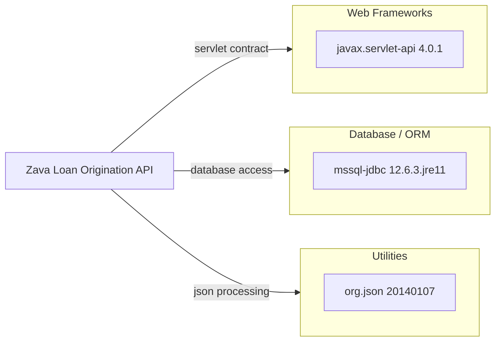

# Dependency Map

This project declares three runtime dependencies in its Gradle build and packages them as a servlet-based WAR for deployment on Tomcat.

## Dependencies

### Dependency Summary

| Category | Count | Key Libraries | Notes |
|---|---:|---|---|
| Web Frameworks | 1 | `javax.servlet-api` | Classic servlet API dependency used by all servlet classes |
| Database / ORM | 1 | `mssql-jdbc` | Direct JDBC access to SQL Server; no ORM abstraction present |
| Utilities | 1 | `org.json` | Lightweight JSON parsing and serialization in request handlers |

### Version & Compatibility Risks

The project targets Java 11 and `javax.servlet` rather than newer Jakarta EE APIs, which raises migration work for modern servlet containers and current Java platform targets. The direct SQL Server JDBC dependency also means platform moves must preserve driver compatibility, connection handling, and SQL Server-specific behavior.

### Notable Observations

- The build has no test-scoped dependencies declared, which aligns with the absence of a test source tree.
- Packaging uses the Gradle WAR plugin, so runtime compatibility depends on an external servlet container rather than an embedded server.
- No dependency is present for resilience, observability, or schema migration tooling.

## Test Dependencies

| Framework | Version | Notes |
|---|---|---|
| None detected | N/A | No test dependencies are declared in `build.gradle` |

Total test-scope dependencies: 0

No test dependencies were detected, and the repository also does not contain a Gradle wrapper or a `src/test` tree.
